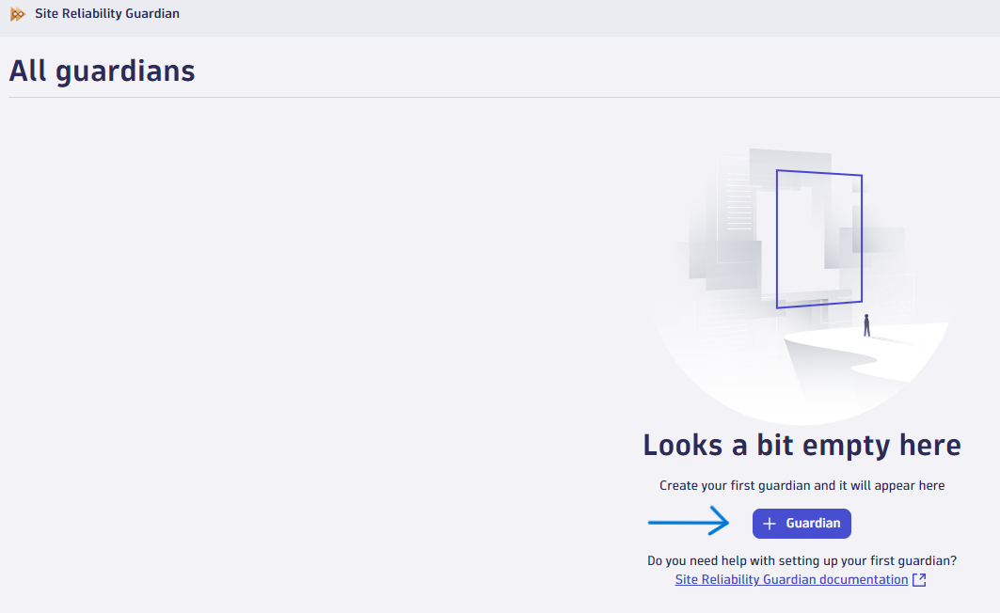
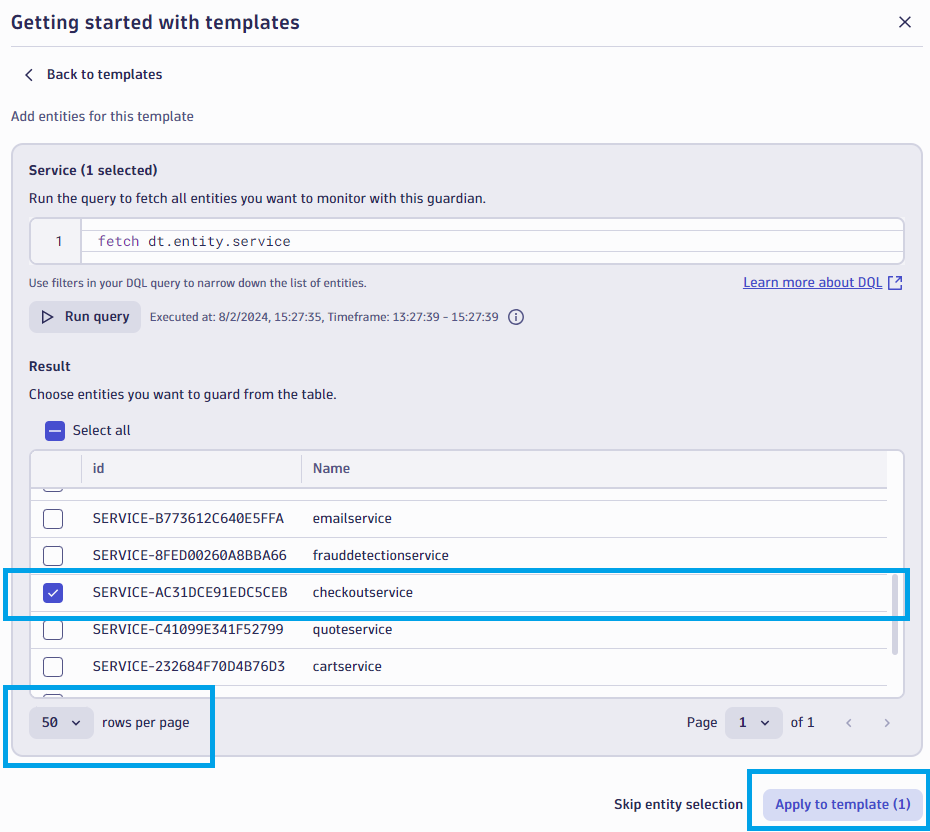
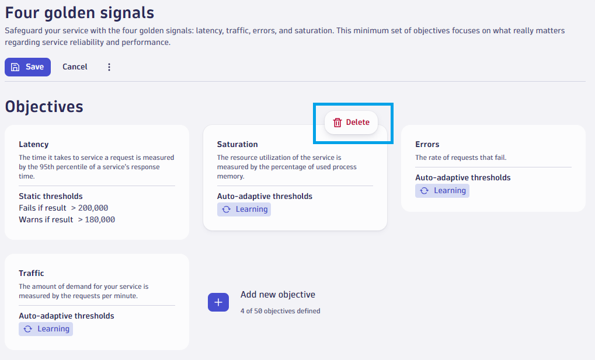

# Create Site Reliability Guardian

--8<-- "snippets/bizevent-create-srg.js"

[Site reliability guardians](https://docs.dynatrace.com/docs/platform-modules/automations/site-reliability-guardian){target="_blank"} are a mechanism to automate analysis when changes are made. They can be used in production (on a CRON) or as deployment checks (eg. pre and post deployment health checks, security checks, infrastructure health checks).

We will create a guardian to check the `checkoutservice` microservice which is used during the purchase journey.

* Press `ctrl + k` search for `Site Reliability Guardian` and select the app.
* Click `+ Guardian` to add a new guardian.
* Under `Four Golden Signals` choose `Use template`.
* Click `Run query` and toggle `50` rows per page to see more services.
* Select the `checkoutservice`. Click `Apply to template (1)`.
* Hover over the `Saturation` objective and delete it (there are no resource statistics from OpenTelemetry available so this objective cannot be evaluated).
* At the top right of the screen, customise the guardian name to be called `Three golden signals (checkoutservice)`.
* Click `Save`

!!! tip "Automate at scale"
    This process can be automated for at-scale usage using [Monaco or Terraform](https://docs.dynatrace.com/docs/manage/configuration-as-code){target="_blank"}.

- [Click Here to Continue:octicons-arrow-right-24:](automate-srg.md)

