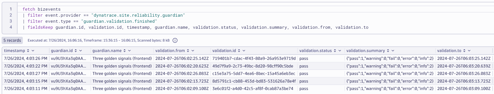

# Enable Automatic Baselining for Site Reliability Guardian

--8<-- "snippets/bizevent-enable-auto-baselines.js"

Objectives that are set to "auto baseline" in Dynatrace Site Reliability Guardians require `5` runs in order to enable the baselines.

In a real scenario, these test runs would likely be spread over hours, days or weeks. This provides Dynatrace with ample time to gather sufficient usage data.

For demo purposes, 5 seperate "load tests" will be triggered in quick succession to enable the baselining.

First, open a new terminal window and apply the load test script:

```
kubectl apply -f .devcontainer/k6/k6-load-test-script.yaml
```

## Trigger the First Load Test

```
kubectl apply -f .devcontainer/k6/k6-srg-training-run1.yaml
```

## Trigger the Second Load Test

Wait a few seconds and trigger the second load test:

```
kubectl apply -f .devcontainer/k6/k6-srg-training-run2.yaml
```

## Trigger the Third Load Test

Wait a few seconds and trigger the third load test:

```
kubectl apply -f .devcontainer/k6/k6-srg-training-run3.yaml
```
## Trigger the Fourth Load Test

Wait a few seconds and trigger the fourth load test:

```
kubectl apply -f .devcontainer/k6/k6-srg-training-run4.yaml
```

## Trigger the Final Training Load Test

Wait a few seconds and trigger the final (fifth) load test:

```
kubectl apply -f .devcontainer/k6/k6-srg-training-run5.yaml
```

## Wait for Completion

Each load test runs for 1 minute. Run this command to wait for all jobs to complete.

This command will appear to hang until the jobs are done. Be patient. It should take about 2mins:

```
kubectl -n default wait --for=condition=Complete --all --timeout 120s jobs
```

```
➜ /workspaces/obslab-release-validation (main) $ kubectl get jobs
NAME               STATUS     COMPLETIONS   DURATION   AGE
k6-training-run1   Complete   1/1           95s        2m2s
k6-training-run2   Complete   1/1           93s        115s
k6-training-run3   Complete   1/1           93s        108s
k6-training-run4   Complete   1/1           90s        100s
k6-training-run5   Complete   1/1           84s        94s
```

## View Completed Training Runs

In Dynatrace, go to `workflows` and select `Executions`. You should see 5 successful workflow executions:


### View SRG Status using DQL

You can also use this DQL to see the Site Reliability Guardian results in a notebook:

```
fetch bizevents
| filter event.provider == "dynatrace.site.reliability.guardian"
| filter event.type == "guardian.validation.finished"
| fieldsKeep guardian.id, validation.id, timestamp, guardian.name, validation.status, validation.summary, validation.from, validation.to
```



## View SRG Status in the Site Reliability Guardian App
The SRG results are also available in the Site Reliabiltiy Guardian app:

* Press `ctrl + k`
* Search for `site reliability guardian` or `srg`
* Open the app and click `Open` on your guardian

You should see the `5` runs listed:


!!! success "Training Complete"
    The automatic baselines for the guardian are now enabled.

    You can proceed to use the guardian for "real" evaluations.

<div class="grid cards" markdown>
- [Click Here to Continue:octicons-arrow-right-24:](run-production-srg.md)
</div>