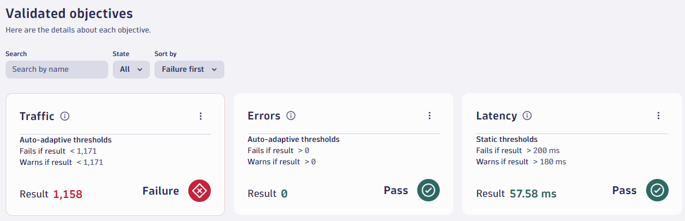

!!! info "Preparation Complete"
    The preparation phase is now complete.
    Everything before now is a one-off task.
    
    In day-to-day operations, you would begin from here.

--8<-- "snippets/bizevent-run-production-srg.js"

## Run an Evaluation

Now that the Site Reliability Guardian is trained, run another evaluation by triggering a load test.

!!! tip
    Remember, the workflow is currently configured to listen for `test finished` events
    but you could easily create additional workflows with different triggers such as on-demand on time-based CRON triggers.

    This provides an ability to continuously test your service (eg. in production).

Run another load test to trigger a sixth evaluation.
```
kubectl apply -f .devcontainer/k6/k6.yaml
```

Again, wait for all jobs to complete. This run will take longer. Approximately 2mins.

```
kubectl -n default wait --for=condition=Complete --all --timeout 120s jobs
```

When the above command returns, you should see:

```
NAME               STATUS     COMPLETIONS   DURATION   AGE
k6-training-run1   Complete   1/1           102s       9m41s
k6-training-run2   Complete   1/1           100s       9m33s
k6-training-run3   Complete   1/1           101s       9m23s
k6-training-run4   Complete   1/1           93s        9m17s
k6-training-run5   Complete   1/1           91s        9m11s
run-k6             Complete   1/1           79s        81s
```

When this evaluation is completed, click the `Refresh` button in the `Validation history` panel of the site reliability guardian app (when viewing an individual guardian) and the heatmap should look like the image below

!!! info "Your results may vary"
    Your results may vary.
    In this example below, the `Traffic` objective failed because the auto-adaptive thresholds detected that a traffic level below `1171` requests is too low and the actual traffic level was `1158`.
    
    Because one objective failed, the guardian failed.

5 training runs and 1 "real" run:




!!! hint "Information Only Objectives"

    It is possible to add objectives that are "informational only" and do not contribute to the pass / fail decisions.

    This is useful for new services where you are trying to "get a feel for" the real-world data values of your metrics.

    To set an objective as "information only":
    * Select the objective to open the side panel
    * Scroll down to `Define thresholds`
    * Select the `No thresholds` option

    

<div class="grid cards" markdown>
- [Click Here to Continue:octicons-arrow-right-24:](enable-change.md)
</div>