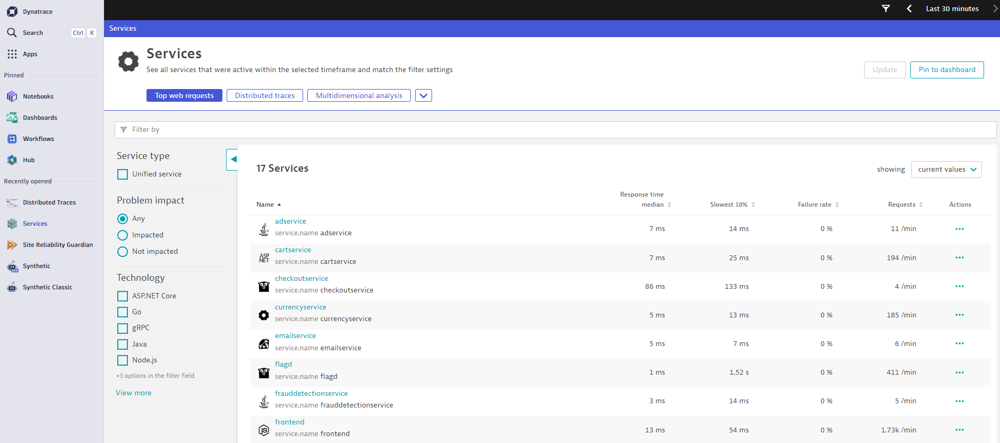
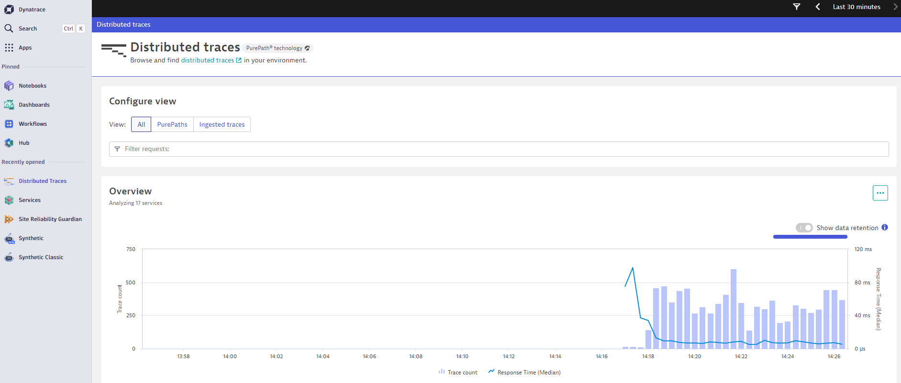
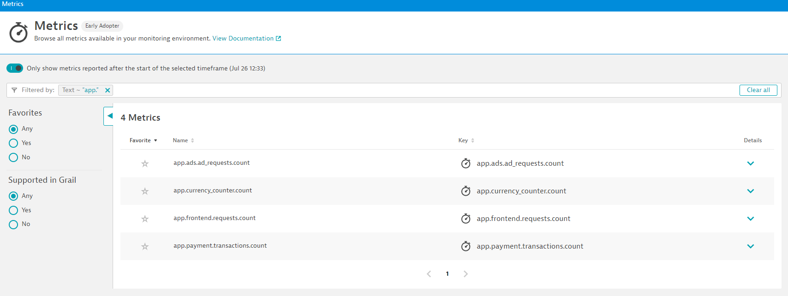

# Start The Demo

After the codespaces has started, the post creation script should begin. This will install everything and will take a few moments.

When the script has completed, a success message will briefly be displayed (it is so quick you'll probably miss it) and an empty terminal window will be shown.


## Wait For Demo to Start

Wait for the demo application pods to start:

```
kubectl -n default wait --for=condition=Ready --all --timeout 300s pod
```

## Access Demo User Interface

Start port forwarding to access the user interface:

```
kubectl -n default port-forward svc/my-otel-demo-frontendproxy 8080
```

Leave this command running. Open a new terminal window to run any other commands.

Go to ports tab, right click the `demo app` entry and choose `Open in browser`.


You should see the OpenTelemetry demo:


## Validate Telemetry

It is time to ensure telemetry is flowing correctly into Dynatrace.

In Dynatrace, follow these steps:

### Validate Services

* Press `ctrl + k`. Search for `services`. Go to services screen and validate you can see services.
* Open a service and validate that the URL contains `SERVICE-****`.
    * If the URL contains `CUSTOM_DEVICE-****`:
        * Press `ctrl + k` and search for `settings`.
        * Go to `Service Detection > Unified services for OpenTelemetry` and ensure the toggle is on.



### Validate Traces

* Press `ctrl + k`. Search for `distributed traces`.
* Go to distributed traces and validate data is flowing.



### Validate Metrics

* Press `ctrl + k`. Search for `metrics`.
* Go to metrics and search for `app.` and validate you can see some metrics.



### Validate Logs

* Press `ctrl + k`. Search for `notebooks`.
* Create a new notebook then click `+` to add a new `DQL` section.
* Use this [Dynatrace Query Language](https://docs.dynatrace.com/docs/platform/grail/dynatrace-query-language){target="_blank"}. Validate you can see some log lines.

```
fetch logs, scanLimitGBytes: 1
| filter contains(content, "conversion")
```


## Telemetry Flowing?

If these four things are OK, your telemetry is flowing correctly into Dynatrace.

If not, please [search for similar problems and / or raise an issue here](https://github.com/dynatrace/obslab-release-validation/issues){target="_blank"}.

<div class="grid cards" markdown>
- [Click Here to Continue:octicons-arrow-right-24:](create-srg.md)
</div>